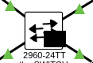

# Simple Secure VLAN-Based Enterprise Network

This project simulates a small enterprise network designed with basic security principles.  
The network is segmented by trust level using VLANs, and inter-VLAN communication is controlled using Access Control Lists (ACLs).

## Diagram

